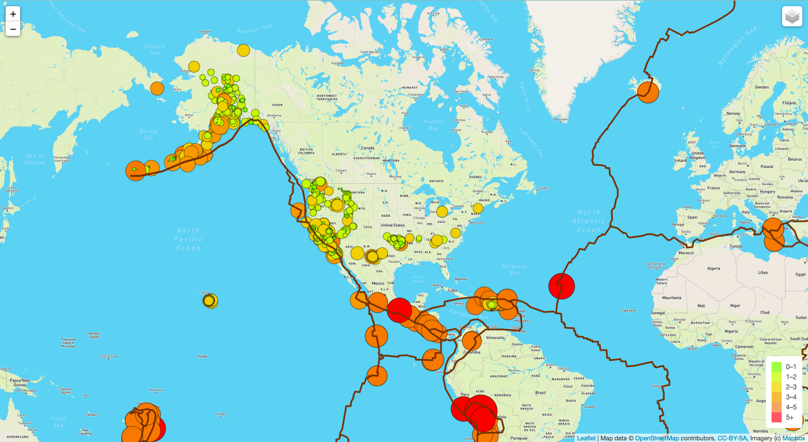
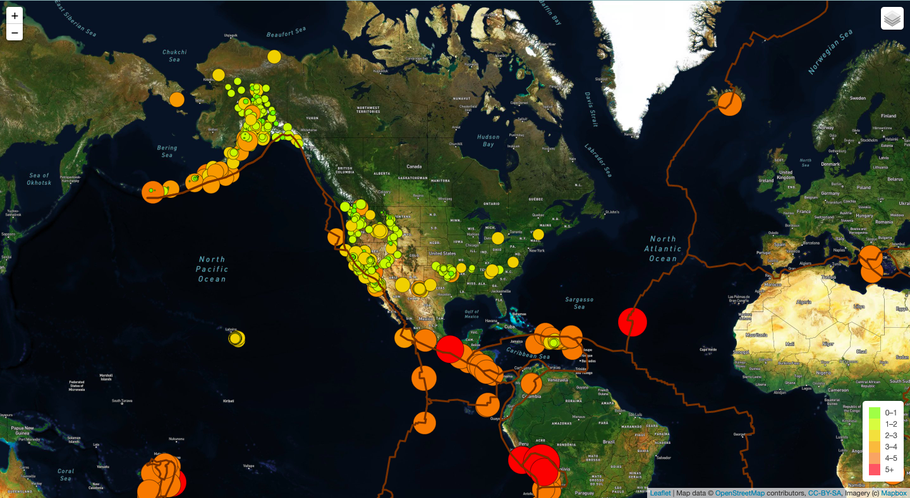
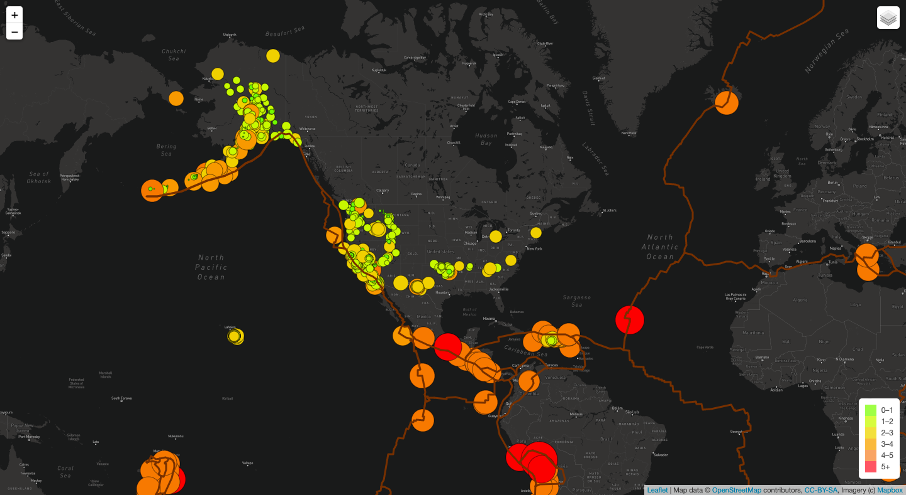

# Mapping_Earthquakes

## Purpose

The purpose of this project is to create an interactive map of earthquakes worldwide within a span of 7 days. Resources and tools used include HTML/CSS, JS, GeoJSON data, Leaflet, MapBox, and D3.

## Results

The following images display the tectonic plates, along with major and minor earthquakes, with the magnitude of the event controlling the radius and color of the circle markers. Images show the street, satellite, and dark view modes that can be toggled in the console.

